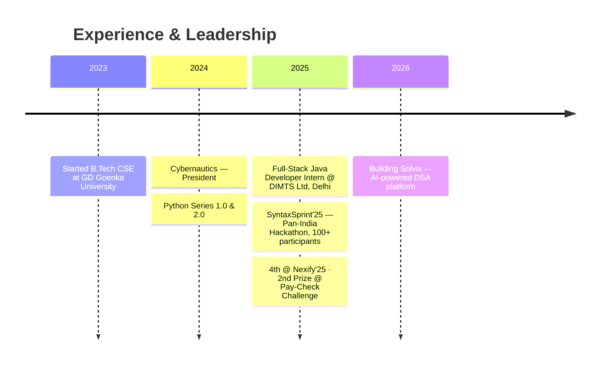

<!-- ═══════════════════════ HEADER ═══════════════════════ -->
<div align="center">


<a href="https://linkedin.com/in/sruti-ranjan">
  
</a>

<p>
<a href="https://linkedin.com/in/sruti-ranjan"></a>
<a href="mailto:pradhansr2003@gmail.com"></a>
<a href="https://leetcode.com/SR_Pradhan"></a>
<a href="https://instagram.com/im.sr._"></a>
<a href="https://github.com/SR-Pradhan"></a>
</p>


</div>

---

<!-- ═══════════════════════ ABOUT ═══════════════════════ -->
## 🚀 About Me


```python
class SrutiRanjanPradhan:
    def __init__(self):
        self.role     = "AI Engineer & Backend Developer"
        self.edu      = "B.Tech CSE @ GD Goenka University · CGPA 9.51"
        self.exp      = "Ex Full-Stack Java Dev Intern @ DIMTS Ltd, Delhi"
        self.lead     = ["Ex-President & VP, Cybernautics",
                         "Organizer, SyntaxSprint'25 — Pan-India Hackathon"]
        self.stack    = ["Python", "FastAPI", "Java", "Spring Boot", "PostgreSQL"]
        self.building = "Solvix — an AI-powered DSA preparation platform"
        self.learning = ["LangGraph & Agentic AI", "System Design", "Docker + CI/CD"]

    def open_to(self) -> list[str]:
        return ["AI / Backend Engineering roles", "LLM & RAG collaborations"]
```

- 🔭 Building **Solvix** — analyses LeetCode/Codeforces submissions and generates AI study plans
- 🧠 Deep into **LLM APIs, RAG, embeddings, LangChain / LangGraph and AI agents**
- ⚙️ Backend at heart — **FastAPI, Flask, Spring Boot, Spring Security, JWT**
- 🏆 **2nd Prize** — Pay-Check Challenge · **4th** — Nexify'25 Hackathon
- 🧩 Solved **300+ problems** across LeetCode, GeeksforGeeks & HackerRank
- 📫 Reach me at **pradhansr2003@gmail.com**

<br clear="right"/>

<!-- ═══════════════════════ STACK AT A GLANCE ═══════════════════════ -->
## 🛠️ Tech Stack

<div align="center">

[](https://skillicons.dev)

</div>

<details>
<summary><b>🧠 AI / ML Engineering</b></summary>
<br/>


</details>

<details>
<summary><b>⚙️ Backend & Languages</b></summary>
<br/>


</details>

<details>
<summary><b>🗄️ Databases & Infrastructure</b></summary>
<br/>


</details>

<!-- ═══════════════════════ PROJECTS ═══════════════════════ -->
## 💡 Featured Projects

<div align="center">
<table>
<tr>
<td width="50%" valign="top">

### 🧩 Solvix
**AI-powered DSA preparation platform**

Analyses LeetCode & Codeforces submissions to surface weak topics, then generates AI study plans with spaced-repetition reminders driven by accuracy, difficulty and problem staleness. Ships AI mock interviews and weekly progress reports.


<a href="https://github.com/SR-Pradhan/Solvix"></a>

</td>
<td width="50%" valign="top">

### 🩺 DoCure.ai
**Multimodal AI healthcare assistant**

Text, voice and image based health assistance built on Groq LLMs, OpenAI Whisper and LLaMA 3 Vision — nutrition guidance, voice consultation, doctor discovery and symptom analysis in one workflow.


<a href="https://github.com/SR-Pradhan/DoCure.ai"></a>

</td>
</tr>
<tr>
<td width="50%" valign="top">

### 😴 Real-Time Drowsiness Detection
**Driver-monitoring computer vision system**

Facial-landmark detection with Eye Aspect Ratio (EAR) to catch prolonged eye closure in real time, firing instant alerts to the driver.


<a href="https://github.com/SR-Pradhan/real-time-drowsiness-detection"></a>

</td>
<td width="50%" valign="top">

### 📝 OnlineQuizWebApp
**Enterprise quiz platform @ DIMTS**

MVC-architected quiz system with dynamic workflows and real-time evaluation for concurrent users, backed by optimized SQL Server queries.


<a href="https://github.com/SR-Pradhan/OnlineQuizWebApp"></a>

</td>
</tr>
</table>
</div>

### 📦 More Work

<div align="center">

| Repository | What it is | Stack |
|:--|:--|:--|
| [**CFI-Road-Safety**](https://github.com/SR-Pradhan/CFI-Road-Safety) ⭐ | AI road-safety analytics pipeline for traffic-violation detection | `Python` `CV` |
| [**secure-auth-system**](https://github.com/SR-Pradhan/secure-auth-system) | Production-style auth with Spring Security + JWT | `Java` `Spring Boot` |
| [**ReTrace**](https://github.com/SR-Pradhan/ReTrace) | Python tooling project | `Python` |
| [**Fresh-Fuel**](https://github.com/SR-Pradhan/Fresh-Fuel) 🥈 | Gym-supplement e-commerce — 2nd place, Pay-Check Challenge | `Shopify` |
| [**Pattern-Wise-DSA**](https://github.com/SR-Pradhan/Pattern-Wise-DSA) | Pattern-wise DSA solutions, optimised and documented | `Java` |
| [**LeetCode-Problems**](https://github.com/SR-Pradhan/LeetCode-Problems) | Ongoing LeetCode solution archive | `Java` |

</div>

<!-- ═══════════════════════ TIMELINE ═══════════════════════ -->
## 🧭 Journey So Far



<!-- ═══════════════════════ STATS ═══════════════════════ -->
## 📊 GitHub Analytics

<div align="center">


<br/><br/>


</div>

<!-- ═══════════════════════ SNAKE ═══════════════════════ -->
### 🐍 Watch my contributions get eaten

<div align="center">
<picture>
  <source media="(prefers-color-scheme: dark)" srcset="https://raw.githubusercontent.com/SR-Pradhan/SR-Pradhan/output/github-snake-dark.svg"/>
  <source media="(prefers-color-scheme: light)" srcset="https://raw.githubusercontent.com/SR-Pradhan/SR-Pradhan/output/github-snake.svg"/>
  
</picture>
</div>

<!-- ═══════════════════════ CODING PROFILES ═══════════════════════ -->

## ⚔️ Competitive Programming

<div align="center">

<a href="https://leetcode.com/SR_Pradhan">
  
</a>
<a href="https://www.geeksforgeeks.org/user/pradhanj44o">
  
</a>
<a href="https://www.codechef.com/users/sr_pradhan">
  
</a>
<a href="https://codeforces.com/profile/SR_Pradhan">
  
</a>

</div>

<!-- ═══════════════════════ ACHIEVEMENTS ═══════════════════════ -->

## 🏆 Achievements

<div align="center">

| 🏅 | Achievement |
|:---:|:---|
| 🥈 | **2nd Prize** — 1st Pay-Check Challenge (₹3,000 reward) |
| 🏆 | **Ranked 4th** — Nexify'25 Hackathon, AI-powered health assistant |
| 🧠 | **300+ coding problems** — LeetCode · GeeksforGeeks · HackerRank |
| 🎤 | **Led SyntaxSprint'25** — Pan-India hackathon with 100+ participants |
| 👨‍🏫 | **Conducted Python Series 1.0 & 2.0** — Cybernautics |
| 🎓 | **CGPA 9.51** — B.Tech CSE, GD Goenka University |

</div>
<!-- ═══════════════════════ FUN ═══════════════════════ -->
## 🎯 Dev Quote of the Day

<div align="center">


</div>

---

<!-- ═══════════════════════ FOOTER ═══════════════════════ -->
<div align="center">

### 💬 Let's build something great together

<a href="mailto:pradhansr2003@gmail.com"></a>
<a href="https://linkedin.com/in/sruti-ranjan"></a>

<br/>

<i>⭐ From <a href="https://github.com/SR-Pradhan">SR-Pradhan</a> — clean, scalable backends and AI that actually ships.</i>


</div>
